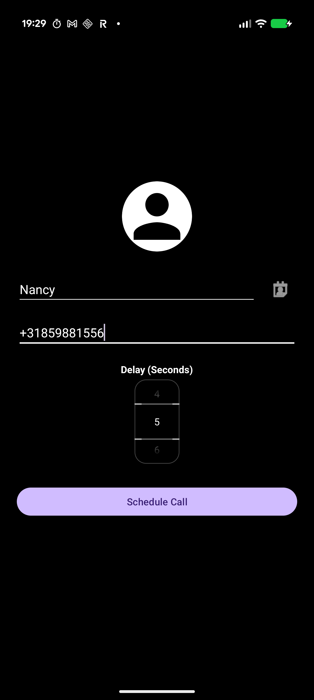
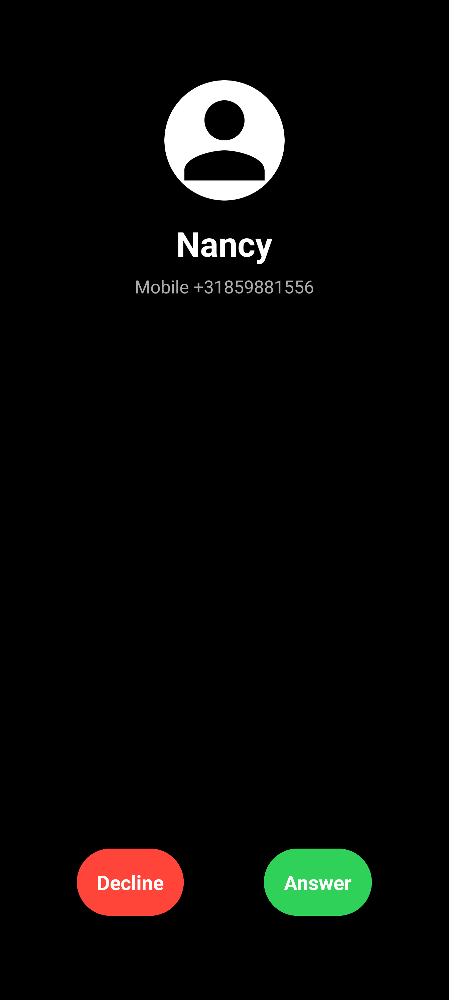
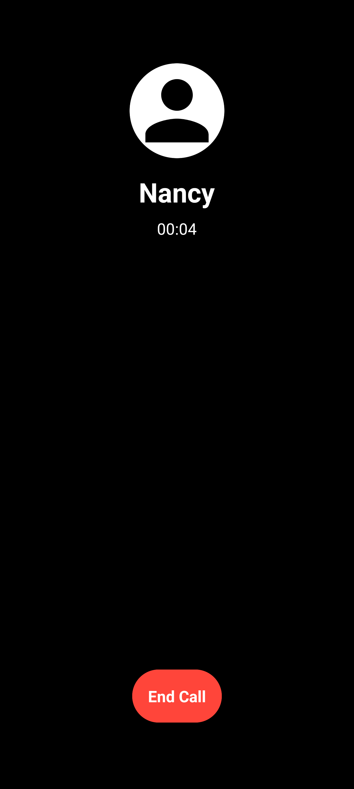

  <h1>Fake Call App</h1>

  

|          **Settings Screen**          |                **Incoming Call**                | **Accepted Call**                               |
|:-------------------------------------:|:-----------------------------------------------:|-------------------------------------------------|
|  |  |  |

An open-source call simulation app to escape awkward situations or play pranks.

Not only I couldn't find an open-source fake caller on the F-Droid or Google Play stores, I couldn't
even find one that looked reasonably modern and not too obvious, worked with the screen off and wasn't run by an obvious ad farm, 
so I decided to vibe code my own. This app will never have any ads or collect any data, forever. 

Tested on Google Pixel 9 Pro XL. Contributions are welcome. 